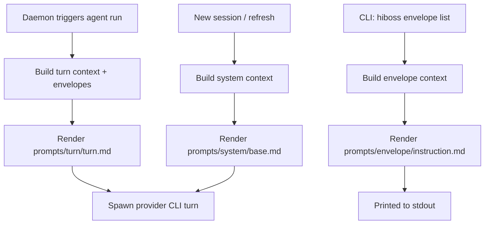

<!--
This directory is the canonical source of prompt/instruction templates used by Hi-Boss.
-->

# Hi-Boss Prompts

Hi-Boss uses **Nunjucks** (Jinja-like) templates under `prompts/` to generate three kinds of text:

1. **System instructions** (agent bootstrap / "system prompt")
2. **Turn input** (what the agent SDK receives each run)
3. **CLI envelope instructions** (what `hiboss envelope list` prints for agents to read)

All agent-facing **keys** in rendered text must remain **kebab-case, lowercase** (e.g. `sender:`).

---

## Design Philosophy

Templates are optimized for:

1. **Token efficiency** — Minimize tokens while preserving clarity. Omit fields when empty (e.g., no `attachments:` block if none). Avoid redundant information (e.g., platform type already in `from:` address).

2. **Dual readability** — Output should be easy to parse for both LLM agents and human developers debugging logs.

3. **Consistent naming** — All output keys use kebab-case lowercase (`sender:`, `created-at:`). No mixing of camelCase or snake_case in rendered output.

4. **Necessary information only** — Include what agents need to act; exclude internal details (e.g., envelope IDs are omitted since agents reply via `from:` address).

5. **Well organized** — Group related fields together. Header first, then content. Use clear section markers (`attachments:` when present).

---

## Prompt Surfaces

### 1) System instructions

- Entrypoint: `prompts/system/base.md`
- Rendered by: `src/agent/instruction-generator.ts`
- Delivered inline to provider CLIs (not written to provider homes):
  - Claude: `claude -p --append-system-prompt ...`
  - Codex: `codex exec -c developer_instructions=...`

Note: system instructions are regenerated when a new session is created (e.g. after `/new` or session refresh policies).

### 2) Turn input

- Entrypoint: `prompts/turn/turn.md`
- Rendered by: `src/agent/turn-input.ts`

Turn input changes apply immediately on the next agent run.

### 3) CLI envelope instructions

- Entrypoint: `prompts/envelope/instruction.md`
- Rendered by: `src/cli/instructions/format-envelope.ts`

This is the agent-facing text emitted by:
- `hiboss envelope list`

---

## Composition Diagram

---

## Template Language (Nunjucks)

- Variables: `{{ agent.name }}`
- Conditionals:
  - `...`
- Loops:
  - `...`
- Includes:
  - ``

Undefined variables throw at render time (to catch typos early).

---

## Template Variables

See `prompts/VARIABLES.md` for the authoritative variable catalog per surface.

---

## Customization (Hi-Boss Files)

Hi-Boss stores optional agent files under its state directory (default `~/hiboss`):

- `~/hiboss/BOSS.md` — boss profile placeholder (created empty by setup; not rendered in the minimal system prompt)
- `~/hiboss/agents/<agent-name>/SOUL.md` — persona placeholder (created empty; not rendered in the minimal system prompt)
- `~/hiboss/agents/<agent-name>/internal_space/MEMORY.md` — auto-injected long-term memory (truncated; default max 36,000 chars; rendered as fenced text when non-empty)

Note: the system prompt is intentionally minimal; most guidance should live in CLI `--help` output and semantic memory.
